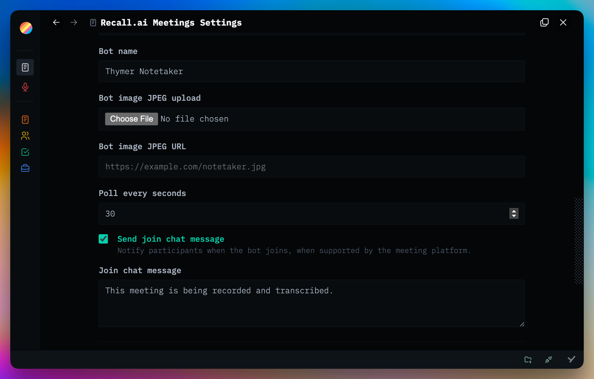

# Meetings

Global plugin that sends a [Recall.ai](https://recall.ai) notetaker to the meeting link on a record, streams the transcript into the page while the meeting runs, and writes a Claude summary with action items when it ends. Attendees are matched to your People records.

It manages **any number of collections**: one it can create for you, and ones you already have — a calendar plugin's **Events** collection, for example. Point it at the property holding the meeting link and it works there too.

Plugins are made with 🤍 for the Thymer community. Free to use, fork, and hack on for <a href="LICENSE" target="_blank" rel="noopener noreferrer">non-commercial use</a>.

Plug-ins take effort, hours, and credits to build. If you find them helpful for you and your workflows, a star ⭐ on the repo, a <a href="https://buymeacoffee.com/akaready" target="_blank" rel="noopener noreferrer">coffee</a> ☕, and a link back to <a href="https://akaready.com" target="_blank" rel="noopener noreferrer">@akaready</a> 🔗 all go a long way. Optional of course, but always appreciated.

Enjoy! 🙏

  

&nbsp;

## 📦 Install

**Recommended:** Use the [Thymer Plugins Manager](https://github.com/ahpatel/thymer-plugins-manager) and install via [this repo's URL](https://github.com/akaready/thymer-meetings) for automatic updates.

**Manual:** in Thymer, run **New Plugin** from the command palette and choose a **global** plugin (not a collection), name it `Meetings`, then paste <a href="plugin.js" target="_blank" rel="noopener noreferrer"><code>plugin.js</code></a> and <a href="plugin.json" target="_blank" rel="noopener noreferrer"><code>plugin.json</code></a> from this repo into its editor.

Installing creates **no collection**. Open **Plugin: Meetings → Collections** and either **create a Meetings collection** (the full schema, ready to go) or **add an existing collection** you want meetings run on. Nothing happens anywhere until you do.

> **Upgrading from 1.x?** 1.x was a collection plugin. 2.0 is global, so it installs alongside rather than over the old one: install it, restore your settings, then use **Clear old plugin code** on the old collection's row to retire the 1.x copy. Your records, transcripts, and summaries are never touched.

&nbsp;

## 🛠️ Setup

You need three things before your first meeting: a **Recall key** (sends the notetaker), a **Claude key** (writes the summary), and a **bridge** (a tiny free helper you put online).

Open **Plugin: Meetings** from the command palette. The **Setup** tab walks you through the same steps with clickable links.

### 1. Get a Recall key

From your Recall dashboard at `https://<region>.recall.ai/dashboard/developers/api-keys`, for example [us-east-1](https://us-east-1.recall.ai/dashboard/developers/api-keys). Pay-as-you-go accounts use [us-west-2](https://us-west-2.recall.ai/dashboard/developers/api-keys).

> **Keys belong to one region.** Pick the same region in the plugin's **Region** setting, or Recall rejects the key with a 401.

### 2. Get a Claude key

From the [Anthropic console](https://console.anthropic.com/settings/keys).

### 3. Put the bridge online

**Free, about two minutes, no terminal.** → **[Follow the bridge guide](./backend/)**

Browsers block direct calls to Recall and Claude (you would only see `Failed to fetch`). The bridge is a tiny Cloudflare Worker you host that passes those requests along. It stores no secrets. Your keys travel with each request.

### 4. Paste them in and run the check

Put the bridge address and both keys into the **Connection** tab. Then open **Setup → Setup Doctor** and click **Run setup check**. It validates the bridge, the KV binding, your Recall key and region, your Claude key and model, and the field bindings without creating a bot or spending anything on a summary.

The **Costs** tab shows a one-hour planning estimate (Recall recording and transcription, the Claude summary for every selectable model, storage) using public list prices before you make your first call.

&nbsp;

## 📚 Collections

Everything Meetings does happens in the collections you list under **Plugin: Meetings → Collections**. There are two kinds.

| | **Meetings collection** (created by the plugin) | **Hosted** (a collection you already have) |
| --- | --- | --- |
| Schema | The full Meetings schema, kept up to date | Only `Bot ID`, `Bot Status`, `Last Error` are added |
| Meeting link | Auto-detected from any url property | **Only** the property you map — nothing is guessed |
| Page headings | Summary / Action items / Notes / Transcript seeded on every new record | Never seeded |
| Automatic booking | On by default | **Off** by default |

Hosted mode is deliberately quiet. A calendar collection carries a link to the event's web page on every single row, so guessing would send paid bots to calendar pages; and every future event with a Meet link would book a bot if automatic booking defaulted on. Map **Meeting URL** to the property that really holds the conferencing link — `Location` or a description is fine, the first link in the text is used — and turn automatic booking on if you want it.

Selecting a row opens its field mapping. **Remove** drops the binding only: the collection, its properties, and everything already written stay exactly where they are.

&nbsp;

## 🎙️ Using it

Add a meeting link to a record in a managed collection. Optionally set a **Date** (the meeting start, like a calendar event).

| `Date` | What happens |
| --- | --- |
| Empty | Click **Join Now**. The notetaker joins immediately. |
| 12 or more minutes out | The notetaker is **booked** and joins two minutes before the Date. **Join Now** is still there if you want it early. |
| Less than 12 minutes out | The notetaker is sent **immediately**, because Recall only guarantees punctuality for bots booked 10 or more minutes ahead. |

Booking happens automatically when **Send the bot automatically to scheduled meetings** is on for that collection (default on for a Meetings collection, off for a hosted one). Clicking a **Scheduled** bot cancels it. Clicking a **Recording** bot stops it.

Three ways to send the notetaker:

- The button in the **Bot Status** property row on the record page.
- The microphone button on an inline reference to a meeting record.
- **Meetings: Join now** in the command palette, on whichever record you have open.

### What lands on the page

Every new record in a **Meetings collection** starts with four headings: **Summary**, **Action items**, **Notes**, and **Transcript**. (Hosted collections are never seeded — the headings appear only where the plugin writes.) Everything the plugin writes goes into the page body, where headings, tasks, speaker blocks, and citation links render properly. There are no Transcript or Summary text properties.

- **Transcript** streams live while the meeting runs, one collapsible block per speaker turn. With **AI topic sections** on, it is regrouped under topic headings when the meeting ends.
- **Summary** is written when the meeting ends: a short overview, then Decisions and Open Questions. Claims cite the transcript with native Thymer reference chips.
- **Action items** are real interactive tasks, written as `<action> — <owner>`.
- **Notes** is yours. The plugin never touches it, and anything you type there is given priority over the transcript when Claude summarizes.

### Properties

- `Meeting URL` and `Date`, as above.
- `Attendees` is the roster. After the meeting, Recall's full participant list (including people who never spoke) is matched against your People collection. Confident email or unique-name matches link silently. Anyone unmatched gets a confirmation dialog so you can fix the name and email, skip, or create a Person. Existing links are never overwritten, and the plugin never creates a Person from a raw display name on its own. Restrict `Attendees` to your People collection for the tightest matching; unrestricted, it auto-detects a People, Contacts, Team, or Staff collection.
- `Related` is an unrestricted multi-record link so you can attach a meeting to a job, client, project, or anything else.
- `Bot ID`, `Bot Status`, and `Last Error` track integration state. The final status is **Transcribed** (automatic summaries off), **Summarized**, or **Summary Failed** (transcript saved, summary needs Repair).

&nbsp;

## ⚙️ Settings

Open **Plugin: Meetings** from the command palette. There is no Save button: edits apply and persist immediately (API keys save when you leave the field). Preferences sync across your devices through the workspace's end-to-end-encrypted plugin configuration. The scope pill in the header shows whether this device follows the shared settings or has its own edits, with push and discard controls.

### Setup
Guided steps, **Setup Doctor** (which now reports per managed collection), and **Diagnostics** (see Maintenance below).

### Connection
| Setting | What it does |
| --- | --- |
| **Bridge URL** | Address of your bridge (step 3). |
| **Recall API key** / **Region** | Your Recall key and the region it came from. They must match. |
| **Recall media retention** | How long future bots keep Recall's audio, video, and transcript artifacts. Defaults to 7 days, inside Recall's free storage window. Does not affect what is already written into Thymer. |
| **Anthropic API key** / **Claude model** | Key and model used to write the summary. |
| **Bot name** / **Bot image** / **Join chat message** | How the notetaker appears in the meeting. The image is a public HTTPS JPEG, 16:9, ideally 1280×720 and under 1.3 MB. |
| **Poll interval** | How often the plugin checks Recall for progress. Default 30 seconds. |

### Collections
Create, add, remove, and map collections (see [Collections](#-collections) above). Field mapping is **per collection**: Meeting URL, Date, Attendees, and Related each point at a property of that collection, and so does its own **Send the bot automatically to scheduled meetings**. **Match participants to Attendees** (on by default) is the one setting here that applies everywhere.

### Transcripts
| Setting | What it does |
| --- | --- |
| **Save transcript** | Write the transcript into the page at all. |
| **Heading text** / **Heading level** | The Transcript heading, default `🎙️ Transcript` at H2. |
| **Layout** | Collapsible speaker blocks (default) or flat inline lines. |
| **Timestamps** | Clock time or elapsed time. |
| **Turn header** | Template for each speaker turn using `{Speaker}` and `{Time}`. Default `[{Time}] {Speaker}`. |
| **Timestamp each speaker turn** | Turn the per-turn time on or off. |
| **Follow live transcript in the open record** | Scroll the open page to the newest line as it streams. |
| **Group into topic sections** | Off by default. When the meeting ends, Claude names topic sections and the transcript is regrouped under them. |
| **Heading template** / **Range style** | Topic section headings using `{Topic}` and `{Range}`. Default `{Topic} | {Range}`. |

### Summary
| Setting | What it does |
| --- | --- |
| **Summary prompt** | The instructions Claude follows. The default asks for a short overview, brief bullets under Decisions and Open Questions, and a separate checkbox list of action items. |
| **Citation label** | Chip text on summary citations: name and time, name only, or time only. |
| **Summary / Action items / Notes headings** | Text and level for each heading. |

### Costs
The one-hour estimate described in Setup, with the selected model highlighted.

**Your API keys follow you across your devices**, scoped per user, so in a shared workspace different users' keys never mix. One honest caveat: other members of a shared workspace can technically inspect the raw plugin configuration, so treat workspace members as trusted. Keys never appear in this repository or the public mirror. The uploaded bot image is the exception: it stays in browser local storage, so re-upload it on each device (or use the image URL setting, which syncs).

&nbsp;

## 🔧 Maintenance

Three command-palette actions work on whichever meeting record you have open.

- **Meetings: Regenerate summary or action items** opens a menu: rewrite the **Summary** or the **Action items**, after a confirmation. Each leaves the other sections and your Notes alone. It does not send a new bot.
- **Meetings: Repair meeting** re-fetches Recall's final artifacts for a meeting with a Bot ID and fills in only what is **missing**: transcript turns, summary sections, citations, attendee links. It never replaces a healthy summary, edited checkboxes, Notes, or anything the plugin did not write. If a summary landed as one glued blob, Repair also runs **Heal mashed summaries** on it.
- **Meetings: Diagnostics** copies a support-ready report to the clipboard: webhook events received, parsed rows, KV state, transcript artifacts, bridge version. It never includes keys, meeting URLs, transcript wording, or account data.

Each refuses politely if the open record is not in a collection Meetings manages.

Two more tools live in **Setup → Diagnostics** only: **Heal mashed summaries** across every managed collection, and **Apply heading format**, which relabels, resizes, and reorders the four section headings and inserts any missing one — on collections Meetings owns only, never on a hosted calendar's events.

> **Kill switch:** the toggle in the settings-panel header disables the whole plugin, including transcript polling. A meeting recorded while it was off won't stream into Thymer until you re-enable it and run **Repair**.

&nbsp;

## 🌉 Bridge and live transcripts

The bridge in [`backend/`](./backend/) forwards the plugin's per-request keys to Recall and Anthropic. When a Bridge URL is set, the plugin also asks Recall to post live `transcript.data` events to the bridge, which is what makes the transcript stream during the meeting. Bind a Cloudflare KV namespace named `RECALL_TRANSCRIPTS` for reliable live updates; without it, the final transcript, attendees, and summary still arrive when the meeting ends. Recall's final artifact is always authoritative.

**Optional hardening.** Setup Doctor reports **Live transcript security** in compatibility mode until the bridge can verify that events really came from Recall. To turn that on: in Recall, open **Developers → API Keys & Secrets** and click **Create Workspace Secret**. Add that value to the Worker under **Settings → Variables and Secrets** as an encrypted variable named exactly `RECALL_WORKSPACE_VERIFICATION_SECRET`, redeploy, and run Setup Doctor again. See [Recall's request-verification guide](https://docs.recall.ai/docs/authenticating-requests-from-recallai).

&nbsp;

## 📊 Anonymous Usage Counter

This plugin pings a <a href="https://www.goatcounter.com/" target="_blank" rel="noopener noreferrer">privacy-respecting counter</a> on first install and once per day of active use. It exists so I can see which plugins are worth continuing to invest in — both "did anyone install it" and "is anyone still using it after a week." Combined with the coffee donations, this is what tells me whether to keep building. It tracks the plugin slug only, no other telemetry or user data, and you can see exactly what I see on the <a href="https://thymer-plugins.goatcounter.com" target="_blank" rel="noopener noreferrer">public dashboard</a>.

**Opt out:** Do Not Track, or `localStorage.setItem('tps-telemetry-opt-out','1')` in the console.
